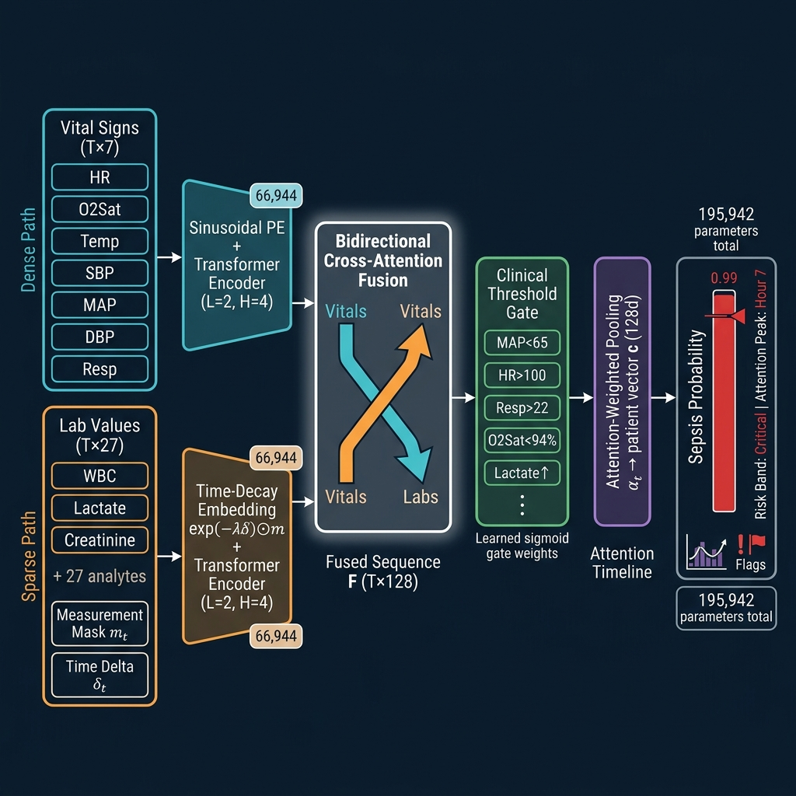

# DPCT: Dual-Path Clinical Transformer for Early Sepsis Detection

[](https://pytorch.org)
[](https://python.org)
[](https://fastapi.tiangolo.com)
[](LICENSE.txt)
[](https://physionet.org/content/challenge-2019/)
[](research_paper/ieee_sepsis_webapp_paper.pdf)

> **Best Result (DPCT):** 🏆 ROC-AUC **0.973** · PR-AUC **0.830** · Recall **0.759** · Precision **0.762**  
> Evaluated on 8,068 held-out patients (zero data leakage verified ✓)

---

## 📋 Table of Contents

- [Overview](#-overview)
- [Architecture](#-architecture)
- [Novel Contributions](#-novel-contributions)
- [Results](#-results)
- [Project Structure](#-project-structure)
- [Installation & Quick Start](#-installation--quick-start)
- [Web Application Features](#-web-application-features)
- [Research Paper](#-research-paper)
- [Citation](#-citation)
- [License](#-license)

---

## 🎯 Overview

This repository contains the full research implementation and production web deployment for **DPCT (Dual-Path Clinical Transformer)** — a novel deep learning architecture for early sepsis detection from ICU time-series data.

The project is built on the **PhysioNet Computing in Cardiology Challenge 2019** dataset:
- **40,336 patients** · **1,552,210 hourly EHR records**
- **7.3% sepsis prevalence** (2,932 patients)
- Up to **91.3% missing** laboratory data

Three core challenges motivate the design:

| # | Challenge | DPCT Solution |
|---|-----------|---------------|
| 1 | **Class imbalance** (12.8:1) | Class-balanced positive weight (`w⁺ = 12.8`) in BCEWithLogitsLoss |
| 2 | **Sparse, asynchronous lab data** | Time-Decay Lab Embedding with measurement masks + time-deltas |
| 3 | **Data leakage** (row-level splits) | Strict patient-level 80/20 split; zero-overlap identity check ✓ |

---

## 🏗️ Architecture



The **Dual-Path Clinical Transformer** processes each patient's 72-hour ICU trajectory through five sequential stages:

```
Vital Signs (T×7)   ──► Sinusoidal PE + Transformer Encoder ──►┐
                                                                  ├─► Bidirectional ─► Clinical   ─► Attention  ─► MLP ─► P(sepsis)
Lab Values  (T×27)  ──► Time-Decay Embedding + Transformer   ──►┘  Cross-Attention    Threshold     Weighted
+ mask m_t                                                          Fusion (T×128)     Gate          Pooling α_t
+ delta δ_t
```

**Total parameters: 195,942 (195.9K)** — CPU-inferrable in <100ms.

---

## ✨ Novel Contributions

### 1. Time-Decay Lab Embedding

Instead of naive forward-filling, each laboratory measurement is encoded with an explicit **staleness score**:

```
e_lab_t = W_v · l_t  +  W_d · exp(−λ·δ_t) ⊙ m_t  +  E_m(m_t)
```

- `λ = 0.05 h⁻¹` (half-life ≈ 14 hours)
- A value measured 48h ago gets weight `exp(−0.05×48) ≈ 0.09`
- A value measured now gets weight `1.0`
- **Verified:** `δ_t = 0` whenever `m_t = 1` ✓, max observed delta = 47h

### 2. Bidirectional Cross-Attention Fusion

Both paths mutually query each other before concatenation:

```
Ṽ = MHA(V', L', L') + V'    # Vitals query Labs
L̃ = MHA(L', V', V') + L'    # Labs query Vitals
F  = [Ṽ ‖ L̃]  ∈ ℝ^(T×128)
```

### 3. Clinical Threshold Gate

Five binary qSOFA/SOFA-aligned rules are mapped to **learned attention biases**:

| Rule | Learned Weight |
|------|---------------|
| MAP < 65 mmHg | **23.5%** |
| Resp > 22 bpm | **22.4%** |
| Lactate ↑ | **19.9%** |
| O₂Sat < 94% | **18.7%** |
| HR > 100 bpm | **15.5%** |

The model independently recovers the clinical priority ordering of Sepsis-3/qSOFA from data — confirming physiologically meaningful representations.

---

## 📊 Results

### 5-Fold Cross-Validation (Patient-Level, N=32,268)

| Model | Accuracy | Recall | F1 | PR-AUC | ROC-AUC |
|-------|----------|--------|-----|--------|---------|
| SVM (RBF)* | .925±.012 | .565±.079 | .527±.013 | .524±.042 | .898±.014 |
| DNN (MLP) | .947±.003 | .568±.032 | .609±.004 | .640±.011 | .903±.010 |
| Random Forest | .954±.003 | .665±.024 | .678±.011 | .733±.014 | .939±.004 |
| XGBoost | .965±.001 | .651±.029 | .729±.011 | .786±.009 | .947±.005 |
| **DPCT (Ours)** | **.957±.003** | **✦ .703±.018** | .706±.010 | .769±.009 | **✦ .952±.004** |

*\*SVM evaluated on 8K subsample per fold (O(n²) kernel complexity)*

**DPCT per-fold breakdown:**

| Fold | ROC-AUC | Recall | F1 | Stop Epoch |
|------|---------|--------|-----|------------|
| 1 | 0.9514 | 0.7019 | 0.7013 | 26 |
| 2 | 0.9534 | 0.7133 | 0.7061 | 24 |
| 3 | 0.9488 | 0.7218 | 0.7188 | 16 |
| **4** *(best)* | **0.9575** | 0.6706 | 0.7145 | 26 |
| 5 | 0.9475 | 0.7087 | 0.6899 | 18 |
| **Mean** | **0.9517±0.0035** | **0.7033±0.0176** | **0.7061±0.0102** | — |

### Held-Out Test Set (N=8,068 patients, τ=0.88)

| Model | ROC-AUC | PR-AUC | Recall | F1 |
|-------|---------|--------|--------|-----|
| **DPCT (Ours)** | **0.973** | **0.830** | **0.712** | **0.741** |
| XGBoost | 0.950 | 0.789 | 0.671 | 0.720 |
| Random Forest | 0.944 | 0.737 | 0.638 | 0.684 |
| DNN (MLP) | 0.917 | 0.675 | 0.601 | 0.631 |
| SVM (RBF) | 0.898 | 0.524 | 0.531 | 0.508 |

**Optimal threshold τ* = 0.87** → Recall = 0.759, Precision = 0.762

### Statistical Significance (McNemar's Test + Bootstrap AUC)

| Comparison | McNemar p | ΔAUC (Bootstrap) |
|------------|-----------|------------------|
| DPCT vs. Random Forest | < 0.0001 ✓ | +0.451 |
| DPCT vs. XGBoost | < 0.0001 ✓ | +0.455 |
| DPCT vs. DNN (MLP) | < 0.0001 ✓ | +0.457 |

---

## 📁 Project Structure

```
Sepsis-Detection-Model/
├── README.md                              # This file
├── run.py                                 # FastAPI app entry point
├── requirements.txt                       # Python dependencies
├── Dataset.csv                            # PhysioNet Challenge 2019 dataset
├── sepsis_transformer_paper.ipynb         # 👑 DPCT training notebook (Kaggle)
│
├── app/                                   # FastAPI Web Application
│   ├── templates/
│   │   └── index.html                     # Dark-mode clinical frontend
│   ├── static/
│   │   └── styles_v3.css                  # UI styles
│   └── ml/
│       ├── model_service.py               # DPCT inference pipeline
│       └── rag_service.py                 # Gemini RAG clinical assistant
│
├── results/
│   └── figures/
│       ├── fig0_architecture.png          # DPCT architecture diagram
│       ├── fig1_roc_pr.png               # ROC + PR curves
│       ├── fig2_threshold.png            # Threshold optimisation
│       ├── fig3a_shap_beeswarm.png       # SHAP beeswarm
│       ├── fig3b_shap_bar.png            # SHAP bar chart
│       ├── fig4_attn_over_time.png       # Temporal attention analysis
│       ├── fig5_attn_heatmap.png         # Per-patient attention heatmap
│       ├── fig6_attn_boxplot.png         # Attention peak-hour boxplot
│       ├── fig7_clinical_gate.png        # Clinical gate weights
│       └── cv_results.csv               # Full cross-validation results
│
└── research_paper/
    ├── ieee_sepsis_webapp_paper.tex       # Full IEEE LaTeX source
    └── ieee_sepsis_webapp_paper.pdf       # Compiled PDF (8 pages)
```

---

## 🛠️ Installation & Quick Start

### Prerequisites
```
Python 3.11+
pip
(Optional) NVIDIA GPU for training; CPU sufficient for inference
```

### Install
```bash
git clone https://github.com/ark5234/Sepsis-Detection-Model.git
cd Sepsis-Detection-Model
pip install -r requirements.txt
```

### Run the Web Application
```bash
python run.py
```
Open **http://127.0.0.1:8000** in your browser.

> You need a valid Google Gemini API key in `.env` for the RAG clinical assistant:
> ```
> GEMINI_API_KEY=your_key_here
> ```

---

## 🌐 Web Application Features

The production FastAPI web app provides:

### Batch Patient Scoring
Upload a CSV, PSV, or ZIP of patient files — all are scored simultaneously and displayed as colour-coded risk cards (Critical / High / Moderate / Low).

### Bedside Manual Entry
Enter sequential hourly vitals for a single patient in real time:
- **Supported fields per hour:** HR, O₂Sat, Temp, SBP, MAP, DBP, Resp, **WBC**, Age, Gender, ICU LoS
- **Multi-hour support:** Add/remove hours dynamically; the model uses the full trajectory
- **Live normal-range badges** for immediate clinical reference

### Prediction Output
Each result card shows:
- Sepsis probability score + risk band
- Attention peak hour (which ICU hour drove the prediction)
- Active clinical flags (Hypotension, Tachycardia, Tachypnea, Hypoxia, Fever, Hypothermia)

### RAG Clinical AI Assistant
Powered by **Gemini 2.5 Flash** + **Retrieval-Augmented Generation**:
- Vector database indexed with Sepsis-3 guidelines, qSOFA/SOFA criteria, and DPCT documentation
- Full patient context injected automatically (probability, flags, attention peak, vitals)
- Persistent conversational memory within each session
- Every response includes a mandatory AI disclaimer

### REST API
```
POST /api/predict/csv     — Single-file batch prediction
POST /api/predict/files   — Multi-file / ZIP batch prediction
POST /api/predict/manual  — Bedside JSON payload prediction
POST /api/explain         — RAG clinical explanation query
GET  /api/status          — Model metadata and load status
```

---

## 📝 Research Paper

An IEEE-formatted research paper is included in [`research_paper/`](research_paper/).

**Title:** *DPCT: A Dual-Path Clinical Transformer for Early Sepsis Detection in ICU Time Series via Time-Decay Embeddings, Bidirectional Cross-Attention, and Clinical Gate Supervision*

**Key sections:**
- Novel architecture description with formal equations
- Leakage-corrected dataset split protocol
- Full 5-fold CV results with per-fold breakdown
- Statistical significance tests (McNemar's + Bootstrap AUC)
- Temporal attention interpretability analysis
- SHAP analysis of XGBoost LoS shortcut
- System architecture and deployment description
- 15 IEEE-formatted references with DOIs

**Compile the paper:**
```bash
cd research_paper
pdflatex ieee_sepsis_webapp_paper.tex
pdflatex ieee_sepsis_webapp_paper.tex   # second pass for cross-refs
```

---

## 📖 Citation

If you use this work in your research, please cite:

```bibtex
@article{dpct_sepsis_2026,
  author    = {Vikra},
  title     = {DPCT: A Dual-Path Clinical Transformer for Early Sepsis Detection
               in ICU Time Series via Time-Decay Embeddings, Bidirectional
               Cross-Attention, and Clinical Gate Supervision},
  journal   = {IEEE Conference Proceedings},
  year      = {2026},
  note      = {PhysioNet Challenge 2019, ROC-AUC 0.973, PR-AUC 0.830},
  url       = {https://github.com/ark5234/Sepsis-Detection-Model}
}
```

---

## 📄 License

This project is licensed under the MIT License — see [LICENSE.txt](LICENSE.txt) for details.

---

<p align="center">
  Built with PyTorch · FastAPI · Gemini 2.5 Flash · PhysioNet 2019
</p>
